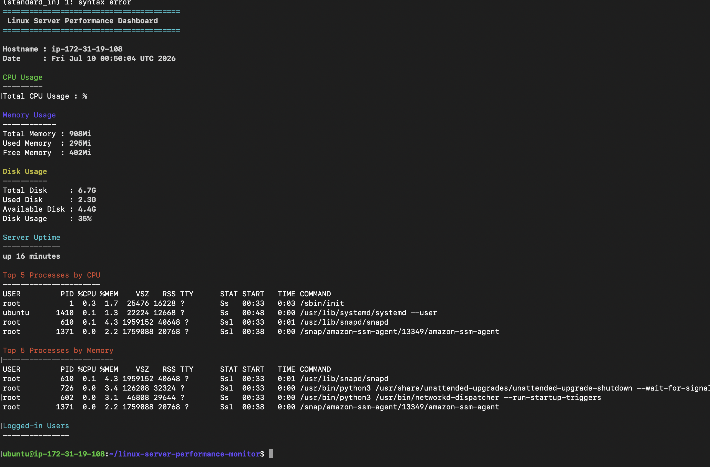

# Linux Server Performance Dashboard

A Bash script that monitors the health and performance of a Linux server.

## Features

- Displays hostname
- Displays current date and time
- Displays CPU usage
- Displays memory usage
- Displays disk usage
- Displays server uptime
- Displays logged-in users
- Lists the top 5 CPU-consuming processes
- Lists the top 5 memory-consuming processes
- Colorized output for better readability

## Technologies Used

- Bash
- Linux
- Ubuntu
- AWS EC2
- Git
- GitHub

## Project Structure

```
linux-server-performance-monitor/
│
├── README.md
├── server-stats.sh
└── screenshots/
    └── dashboard.png
```

## How to Run

Clone the repository:

```bash
git clone https://github.com/Joshpanamera/linux-server-performance-monitor.git
```

Navigate into the project:

```bash
cd linux-server-performance-monitor
```

Make the script executable:

```bash
chmod +x server-stats.sh
```

Run the dashboard:

```bash
./server-stats.sh
```

## Screenshot



## Skills Demonstrated

- Linux Administration
- Bash Scripting
- AWS EC2
- SSH
- Git Version Control
- GitHub
- Server Monitoring
- Linux Process Management